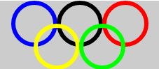

Olympic Rings
=============

  

In this assignment you will write a program that displays a design similar to the Olympic Rings. Your program will have about 13 lines of code and use the following functions (some more than once):

*`ellipse()`
*`size()`
*`noFill()`
stroke()
strokeWeight()
You may find these RGB Color Codes helpful. You might also want to try out the smooth() function.

Don't hesitate to ask for help if your aren't sure how something is suppose to work.